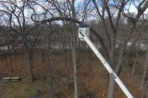

The appearance and health of trees can make or break a property's overall appeal. This is why we offer structural support for trees throughout [North New Jersey](/servicing-areas/).

## What Are Tree Crane Services?

When a tree is too large or too heavy to remove and carry away by hand, a tree service crane is used. Put simply, craning a tree makes it easier to remove it from your property, lower it safely and send it on to its next destination. As such, when you're picking a tree care company for a big job, you'll want to work with one that is fully insured, licensed, and has the experience and crane equipment needed to handle it.

While some trees can live for centuries without any help, others with weak wood or branches can split due to wind and other natural causes. With our tree crane services, you no longer have to worry about the structural integrity of your trees. When you hire Big Foot Tree Service, we work carefully to ensure your trees aren't damaged during the cabling and bracing process. Once we're done, rest easy knowing your trees will be safe and secure for many years.

If you think some of the trees around your property would benefit from our tree crane services, [contact](/contact/) the team at Big Foot Tree Service today!
