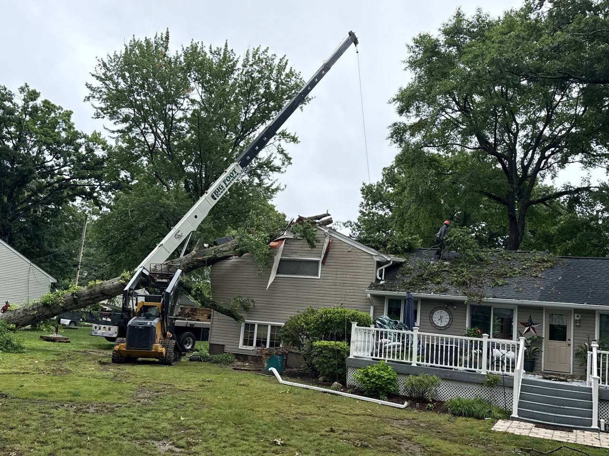

Few things are scarier than a wicked storm causing the trees on your property to go haywire. Whether the storm knocks a chunk of a tree down and leaves a mess on your lawn, or it bends a tree in a precarious direction that could put your home or the power lines at risk, the tree experts at Big Foot Tree Service are here to help.

Emergency tree issues can happen at any time of day, and although they often happen in the winter, they can occur during any season from inclement weather such as snow, ice, heavy winds, rain and more. As such, Big Foot Tree Service is available to provide emergency [tree removal](/tree-removal/) services 365 days a year, 7 days a week. Protecting your home and your safety is our number one priority, so we will quickly and effectively remove any hanging limbs or fallen trees that could pose a hazardous risk to you and your home or business property.

## A Tree Care Company You Can Trust!

Whether you need us to remove one tree or several, we are here when you need us most. If a storm has damaged the trees around your property, don't go another day without hiring our team to remove them. We offer affordable prices and we serve [several counties](/servicing-areas/) throughout Northern New Jersey. What's more, we're fully licensed and insured by the state and have years of tree care experience, which allows us to handle jobs big and small. Give us a [call](tel:9738858000) today to schedule an appointment.
